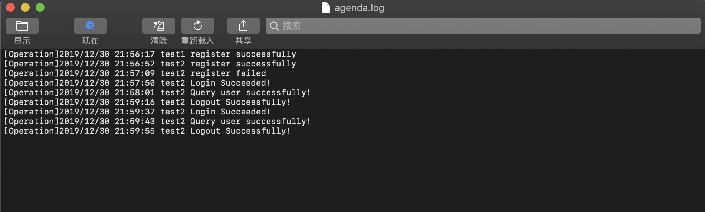

## CLI开发实战-Agenda

**17343099**
**沈方哲**

****

#### 一、实验环境

macOS 10.14.6

go version go1.13.4 darwin/amd64

#### 二、功能需求

[Agenda 业务需求](https://pmlpml.github.io/ServiceComputingOnCloud/ex-cli-agenda#附件agenda-业务需求)

由于本次作业任务不组队，因而只要求完成了简化版的Agenda

#### 三、实验内容

##### 1.安装Cobra

首先使用以下命令安装，由于不能科学上网所以会报几个错
```
go get -v github.com/spf13/cobra/cobra
```

接下来到$GOPATH/src/golang.org/x目录下，用git clone下载sys和text项目
```
git clone https://github.com/golang/sys
git clone https://github.com/golang/text
```

之后再次执行`go get -v github.com/spf13/cobra/cobra`就可以看到在 $GOBIN 下出现了 cobra 可执行程序


##### 2.使用Cobra建立Agenda项目

首先使用以下命令创建：
```
cobra init agenda --pkg-name ./
```

下一步修改`main.go`中的import路径如下：
```go
import "github.com/sysu-five/agenda/cmd"
```

本次实验完成了`"register"`，`"login"`，`"logout"`，`"queryuser"`四个功能。  
使用 `cobra add` 添加功能指令，之后 build 并测试执行 main 如下：


##### 3.Agenda架构

项目文件结构如下：

其中 entity 实现数据访问层，src 实现业务逻辑层，cmd 通过cobra实现表示层，data 文件夹用于存放数据。

##### 4.实验代码

[github]()

#### 四、测试结果

测试register:


测试login queryuser logout:


Log日志结果:

