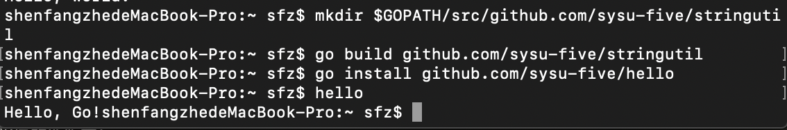

## 安装Go语言开发环境

**17343099**
**沈方哲**

****

### 一.安装VSCode编辑器

Visual Studio Code 是一个轻量级但功能强大的源代码编辑器，可在 Windows，macOS 和 Linux 桌面上运行。它内置了对JavaScript，TypeScript和Node.js的支持，并为其他语言（如C ++，C＃，Java，Python，PHP，Go）和运行时（如.NET和Unity）提供了丰富的扩展生态系统。  

以Mac OS系统为例，进入[VScode官网](https://code.visualstudio.com)，点击"Download for Mac"，按照安装提示操作即可，这里不做赘述了。  

### 二.安装Golang

同样本次实验的实验环境为macOS 14.1  

#### 2.1 安装

使用`brew`进行安装：
```
brew install go
```

验证安装：
```
go version
```

结果截图：


#### 2.2 配置环境变量

首先使用go env查看环境变量：
```
go env
```


其中GOROOT为go安装的目录，GOPATH为你编写代码存放的目录。在此我已经配置好GOPATH目录为`GOPATH="/Users/sfz/Desktop/Go`  

### 三.测试hello world

#### 3.1 创建工作空间

输入命令：
```
mkdir -p $GOPATH/src/github.com/sysu-five/hello
```

#### 3.2 编写hello.go

在上一步创建的包目录下创建hello.go文件，其代码如下：
```go
package main

import "fmt"

func main()
{
	fmt.Printf("Hello, world.\n")
}
```

#### 3.3 编译运行

首先使用go工具构建并安装此程序：
```
go install github.com/sysu-five/hello
```

此命令会构建 hello 命令，产生一个可执行的二进制文件。 接着它会将该二进制文件作为 hello 安装到工作空间的 bin 目录中。在我们的例子中为 $GOPATH/bin/hello。go 工具只有在发生错误时才会打印输出，因此若这些命令没有产生输出，就表明执行成功了。

现在，可在命令行下输入它的完整路径来运行它：
```
$GOPATH/bin/hello
```

因为已经将 $GOPATH/bin 添加到PATH中了，因此直接输入该二进制文件名也可执行：
```
hello
```

实验结果：
  

### 四.编写测试第一个包

#### 4.1 编写一个包

首先创建包目录：
```
mkdir $GOPATH/src/github.com/sysu-five/stringutil
```

接着在该目录中创建reverse.go文件，其代码如下：
```go
package stringutil

// Reverse函数将其实参字符串以字符为单位左右反转。
func Reverse(s string) string {
	r := []rune(s)
	for i, j := 0, len(r)-1; i < len(r)/2; i, j = i+1, j-1 {
		r[i], r[j] = r[j], r[i]
	}
	return string(r)	
}
```

使用go build命令编译：
```
go build github.com/sysu-five/stringutil
```

#### 4.2 测试使用4.1中编写的包

修改3.2中编写的hello.go文件如下（使其使用stringutil包）：
```go
package main

import (
	"fmt"
	"github.com/sysu-five/stringutil"
)

func main() {
	fmt.Printf(stringutil.Reverse("!oG ,olleH"))
}
```

再次执行：
```
go install github.com/sysu-five/hello
```

运行此程序的新版本：
```
hello
```

得到如下结果：


### 五.使用go test测试

Go拥有一个轻量级的测试框架，它由 go test 命令和 testing 包构成。

首先创建文件 $GOPATH/src/github.com/sysu-five/stringutil/reverse_test.go ，其内容如下：
```go
package stringutil

import "testing"

func TestReverse(t *testing.T) {
	cases := []struct {
		in, want string
	}{
		{"Hello, world", "dlrow ,olleH"},
		{"Hello, 世界", "界世 ,olleH"},
		{"", ""},
	}
	for _, c := range cases {
		got := Reverse(c.in)
		if got != c.want {
			t.Errorf("Reverse(%q) == %q, want %q", c.in, got, c.want)
		}
	}
}
```

接着使用 go test 进行该测试：
```
go test github.com/sysu-five/stringutil
```

测试结果如下：

