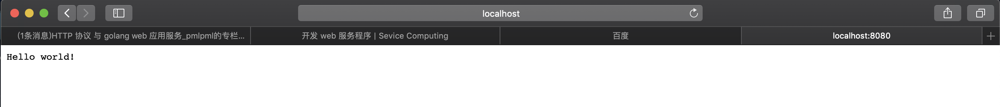
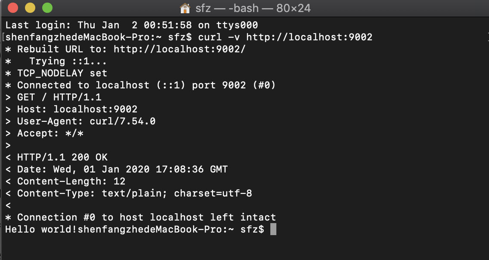
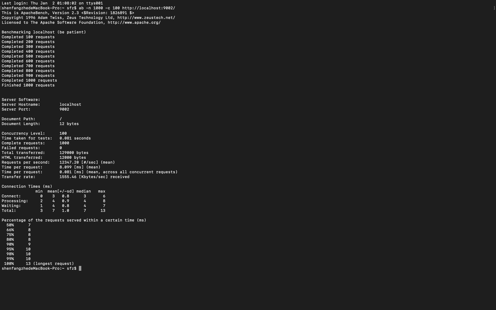

## 开发简单Web服务程序cloudgo

**沈方哲**  
**17343099**

****

### 实验任务

1. 熟悉 go 服务器工作原理  
2. 基于现有 web 库，编写一个简单 web 应用类似 cloudgo  
3. 使用 curl 工具访问 web 程序  
4. 对 web 执行压力测试  

### 实验环境

macOS 10.14.6

go version go1.13.4 darwin/amd64

### 框架选取

选择：Martini

介绍：[Golang Martini框架入门](https://www.cnblogs.com/sitemanager/p/3973907.html)

理由：基础功能完善，网上中文教程全面，简单好学

安装：`go get github.com/codegangsta/martini`

### 代码实现

学习教程：[课程博客](https://blog.csdn.net/pmlpml/article/details/78404838)

`main.go` 使用老师课程博客中的内容，完成端口绑定、端口解析和启动server的操作。  
`service.go` 使用Martini框架的函数格式具体定义启动server后的操作。

### 测试结果

首先在终端输入`go run main.go`，通过浏览器访问`localhost:8080`，看到输出了"Hello world!"  

#### curl测试

使用端口9002测试，首先在终端输入`go run main.go -p 9002`  
打开另一个终端，输入`curl -v http://localhost:9002`，得到结果如下：

#### ab测试

因为此电脑已经安装过ApacheBench，所以直接在终端输入`ab -n 1000 -c 100 http://localhost:9002/`，得到如下结果：

* 参数`-n`表示执行请求的数量，`-c`表示并发请求的数量。  
* Requests per second（吞吐率）：服务器并发处理能力的量化描述，指在某个并发用户数下单位时间内处理的请求数量。  
* Time per request（平均请求等待时间）：处理完成所有请求所花费的总时间/（总请求数/并发用户数）。  
* 服务器平均请求等待时间：处理完成所有请求所花费的总时间/总请求数。它是吞吐率的倒数。  

