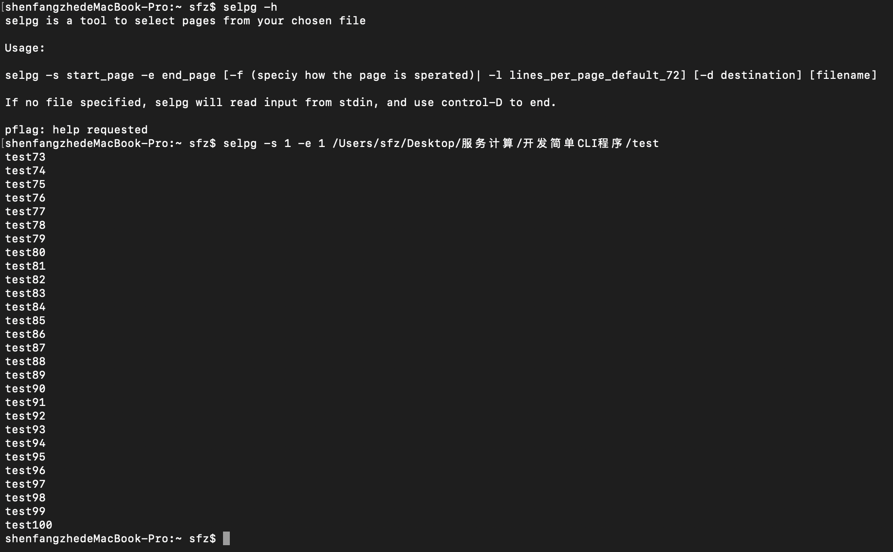
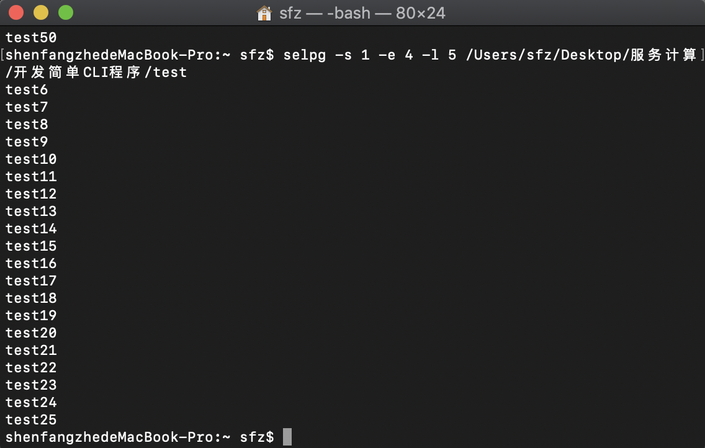
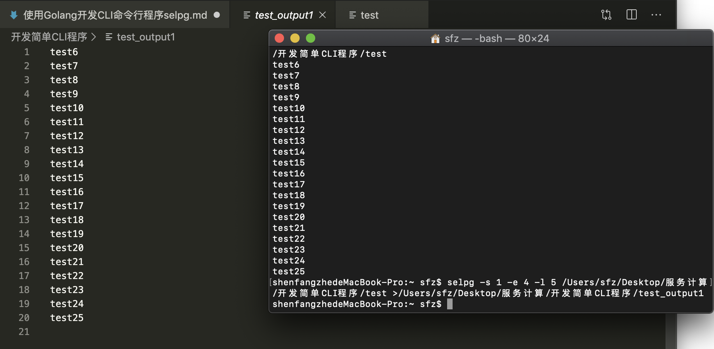

## 使用Golang开发CLI程序selpg

**17343099**
**沈方哲**

****

### CLI

#### CLI概述

CLI（Command Line Interface）实用程序是Linux下应用开发的基础。正确的编写命令行程序让应用与操作系统融为一体，通过shell或script使得应用获得最大的灵活性与开发效率。Linux提供了cat、ls、copy等命令与操作系统交互；go语言提供一组实用程序完成从编码、编译、库管理、产品发布全过程支持；容器服务如docker、k8s提供了大量实用程序支撑云服务的开发、部署、监控、访问等管理任务；git、npm等都是大家比较熟悉的工具。尽管操作系统与应用系统服务可视化、图形化，但在开发领域，CLI在编程、调试、运维、管理中提供了图形化程序不可替代的灵活性与效率。

#### 基础知识

几乎所有语言都提供了完善的 CLI 实用程序支持工具。命令行程序主要涉及内容：  
* 命令  
* 命令行参数  
* 选项：长格式、短格式  
* IO：stdin、stdout、stderr、管道、重定向  
* 环境变量  

#### Golang支持

使用`os`，`flag`包

学习参考：
[标准库—命令行参数解析FLAG](http://blog.studygolang.com/2013/02/标准库-命令行参数解析flag/)

****

### Selpg

#### 程序逻辑

selpg 是从文本输入选择页范围的实用程序。该输入可以来自作为最后一个命令行参数指定的文件，在没有给出文件名参数时也可以来自标准输入。具体需求介绍参见[开发 Linux 命令行实用程序](https://www.ibm.com/developerworks/cn/linux/shell/clutil/index.html)  

#### 代码实现

程序逻辑不算复杂，但还是参考了好几篇学长的博客，debug一个下午，才总算是大概实现了所需功能。

**** 

### 实验结果

1. test1
抽取第一页输出到命令行，默认72行一页，因此从73行开始输出。

2. test2
以每页5行抽取第一页到第四页输出到命令行，因此从第6行输出到第25行。

3. test3
同样以每页5行抽取第一页到第四页，输出到test_output1。
