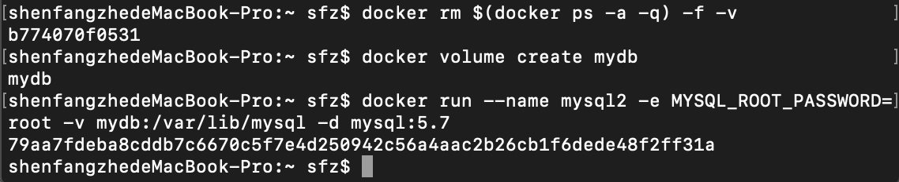

## 玩转Docker容器技术

**沈方哲**  
**17343099**

****

### 一、准备Docker环境

本次实验的实验环境为 MacOS 10.14.6

首先使用Homebrew工具，输入`brew cask install docker`  
安装完成后启动台出现Docker程序，打开运行，需输入密码，之后在终端输入`docker --version`  
结果如下，Docker安装成功：  

### 二、Docker基本操作

#### 运行第一个容器

在终端输入`docker run hello-world`，第一次遇到网络原因导致报错，经过查询学习后找到解决办法，修改`daemon.json`文件的内容以修改docker镜像源为国内镜像源，再次运行`docker run hello-world`成功。实验结果截图如下：  

#### Docker基本操作

首先运行一个Ubuntu container：

显示本地镜像库内容：

使用 `docker ps` 查看运行中的容器， `docker ps -a` 查看所有容器（包含已中止的）：

继续运行原容器并进入：

### 三、MySQL与容器化

首先拉取MySQL镜像：

使用MySQL容器，首先启动服务器：

接着启动客户端：

测试MySQL客户端基本操作：

查看数据库文件：

创建卷并挂载：

启动客户端容器链接服务器：

Docker compose 与多容器应用自动化部署：

成功安装了docker-compose也按照PPT编写了stack.yml，但是每次启动服务时都报错，尝试通过百度等途径解决该问题但一直没有成功。
